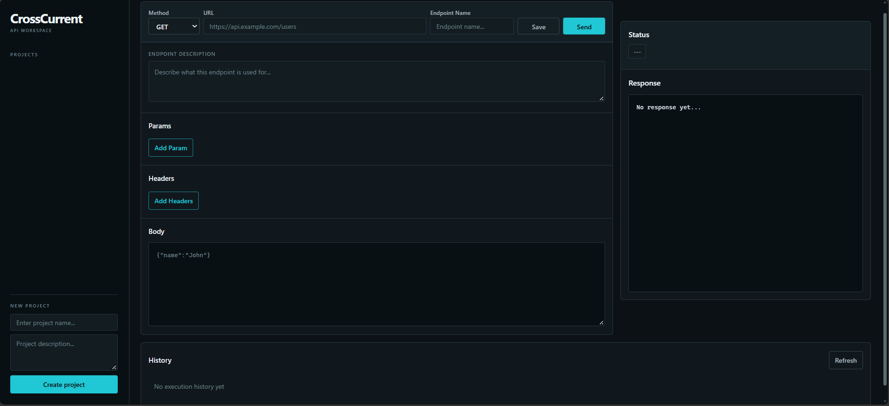

# CrossCurrent

A developer-focused API workspace for organizing, configuring,
executing, and inspecting HTTP requests.

CrossCurrent combines reusable API endpoints, backend-controlled request
execution, persistent PostgreSQL storage, and execution history in one
workspace.



> **V1 is intentionally focused on a complete developer workflow rather
> than maximum feature count.**

> **Historical note:** Earlier development documentation may refer to
> this project as **Chimera** or **Pulse**. These were previous
> project/working names; **CrossCurrent** is the final product identity.

> Known main V1 limitations:

> - no authentication
> - single shared workspace/database
> - free-tier deployment may experience cold starts

------------------------------------------------------------------------

## Live Demo

**Application:** <https://crosscurrent-mz20.onrender.com>

**Backend services:** - [Flask
API](https://crosscurrent-flask.onrender.com) - [Go Execution
Service](https://crosscurrent-go.onrender.com)

Deployed with **Render + Supabase PostgreSQL**.

------------------------------------------------------------------------

## Overview

``` text
Project
   ↓
Endpoint
   ↓
Configure Request
   ↓
Execute
   ↓
Inspect Response
   ↓
Review History
```

A **Project** organizes related API work.

An **Endpoint** is a reusable HTTP request definition containing its
method, URL, query parameters, headers, and optional body.

An Endpoint must be **saved before it can be executed**.

Each execution produces an immutable **Execution** record, and an
Endpoint's History is a view over its stored executions.

------------------------------------------------------------------------

## Features

-   Project and Endpoint CRUD
-   Reusable HTTP request configurations
-   Dynamic query parameter and custom header editors
-   Request body configuration
-   GET, POST, PATCH and DELETE execution
-   Backend-controlled outbound HTTP requests
-   Basic SSRF protection for outbound targets
-   Response inspection
-   Persistent execution records
-   Endpoint-specific execution history
-   Historical response inspection
-   PostgreSQL persistence with JSONB request data

------------------------------------------------------------------------

## Architecture

CrossCurrent uses a layered Python backend together with a dedicated Go
service for execution-history persistence and retrieval.

``` text
                         CrossCurrent UI
                      HTML / CSS / JavaScript
                              │
                              ▼
                     Python / Flask API
                         │          │
                         │          └──────→ External HTTP API
                         │
                         ▼
                  Go Execution Service
                         │
                         ▼
                Execution Repository
                         │
                         ▼
                    PostgreSQL
```

The Python application follows:

``` text
Route
  ↓
Controller
  ↓
Service
  ↓
Repository
  ↓
PostgreSQL
```

### Backend Responsibilities

**Python / Flask** - Project and Endpoint management - Request
configuration - CRUD and application logic - Outbound HTTP execution -
Execution coordination

**Go** - Execution persistence - Execution history retrieval

Go was introduced as a specialized subsystem rather than replacing the
established Python execution layer.

------------------------------------------------------------------------

## Request Execution

Execution is deliberately kept behind the backend:

``` text
Frontend
   ↓
Flask API
   ↓
External HTTP API
   ↓
Execution Result
   ├──→ Frontend Response Viewer
   └──→ Go Execution Service
            ↓
        PostgreSQL
```

This keeps outbound request execution and persistence outside the
browser.

A successful external response remains available even if secondary
history persistence fails.

------------------------------------------------------------------------

## Persistence

PostgreSQL is the persistent source of truth for:

-   Projects
-   Endpoints
-   Executions
-   Endpoint request configuration

Params, Headers and Body are stored using PostgreSQL `JSONB`.

Database-generated IDs and timestamps are used, while Project → Endpoint
ownership is enforced through foreign keys and cascading deletion.

------------------------------------------------------------------------

## Production Deployment

The production architecture is:

``` text
Browser
   ↓ HTTPS
Render Static Site
   ↓ HTTPS
Flask API
   ↓ HTTPS
Go Execution Service
   ↓
Supabase PostgreSQL
```

Production configuration is supplied through:

``` text
DATABASE_URL
GO_SERVICE_URL
PORT
```

The browser communicates with the Flask API rather than directly
accessing the Go service or database.

The production database is initialized from the shared
`database/schema.sql` definition and does not depend on local
development data.

------------------------------------------------------------------------

## Technology Stack

  Layer          Technologies
  -------------- --------------------------------------------------------
  Frontend       HTML, CSS, Vanilla JavaScript, Fetch API, DOM APIs
  Backend        Python, Flask, Requests
  Go Service     Go, `net/http`, `database/sql`, `encoding/json`, `pgx`
  Database       PostgreSQL, JSONB
  Architecture   Layered Architecture, Repository Pattern
  Deployment     Render, Supabase

------------------------------------------------------------------------

## Local Development

### Prerequisites

-   Python
-   Go
-   PostgreSQL
-   A modern web browser

Local database configuration uses the existing environment-based
configuration. Production services use `DATABASE_URL`, `GO_SERVICE_URL`,
and the deployment-provided `PORT`.

Local development should use its own database/configuration rather than
the production database.

For detailed setup and implementation context, see
[`Architecture.md`](docs/Architecture.md).

------------------------------------------------------------------------

## Project Structure

``` text
CrossCurrent/
│
├── backend/
│   ├── python/
│   └── go/
│
├── frontend/
│
├── database/
│   └── schema.sql
│
├── docs/
│   ├── Architecture.md
│   ├── DecisionLog.md
│   ├── LearningLog.md
│   └── Resources.md
│
├── .gitignore
└── README.md
```

The detailed internal structure is documented in
[`Architecture.md`](docs/Architecture.md).

------------------------------------------------------------------------

## Development Approach

CrossCurrent was built incrementally using **Foundation → Vertical Slice
Development**.

``` text
Foundation
   ↓
Projects
   ↓
Endpoints
   ↓
Request Execution
   ↓
Params + Headers
   ↓
PostgreSQL Persistence
   ↓
Execution History
   ↓
Product Polish
   ↓
Deployment
```

Each slice introduced a meaningful capability while keeping the system
functional throughout development.

The project was built as a learning-through-building exercise, with
architectural reasoning, implementation problems, and resources
documented alongside the code.

------------------------------------------------------------------------

## Design Principles

### Separation of Concerns

Routes, controllers, services, repositories, and models have distinct
responsibilities.

### Backend as Source of Truth

The frontend refreshes its state from backend data after successful
mutations.

### Domain Ownership

``` text
Project
   ↓
Endpoint
   ↓
Execution
```

Projects own Endpoints, Endpoints contain request configuration, and
Executions represent individual attempts.

### Execution Separation

An Endpoint defines a request; it does not execute itself.

### Repository Abstraction

Persistence is isolated behind repositories so storage concerns do not
leak into higher application layers.

### Deliberate Scope

Features that do not contribute to the current V1 objectives are
postponed rather than added for the sake of feature count.

------------------------------------------------------------------------

## V1 Scope

CrossCurrent V1 focuses on:

-   Project and Endpoint management
-   Request configuration
-   HTTP request execution
-   Response inspection
-   PostgreSQL persistence
-   Execution records and history

Authentication, multi-user workspaces, and additional platform features
are outside the current V1 scope.

------------------------------------------------------------------------

## Documentation

The README stays focused on the finished system. The deeper engineering
story lives in the project documentation.

  -------------------------------------------------------------------------------
  Document                                    Purpose
  ------------------------------------------- -----------------------------------
  [`Architecture.md`](docs/Architecture.md)   System architecture and technical
                                              structure

  [`DecisionLog.md`](docs/DecisionLog.md)     Important engineering decisions and
                                              reasoning

  [`LearningLog.md`](docs/LearningLog.md)     Concepts learned, implementation
                                              problems and lessons

  [`Resources.md`](docs/Resources.md)         Documentation and references used
                                              during development
  -------------------------------------------------------------------------------

------------------------------------------------------------------------

## Status

### Version 1 --- Core System Complete

CrossCurrent V1 covers the complete core workflow:

``` text
Projects
   ↓
Endpoints
   ↓
Request Configuration
   ↓
HTTP Execution
   ↓
Response Inspection
   ↓
Persistent Execution History
```

The application is deployed using Render and Supabase without changing
its established domain model or backend responsibility boundaries.

------------------------------------------------------------------------

## Why CrossCurrent?

CrossCurrent began as a way to learn by building rather than assembling
isolated tutorials.

What started as a small API-workspace prototype evolved into a complete
system involving:

-   layered backend architecture
-   frontend ↔ backend communication
-   outbound HTTP execution
-   PostgreSQL persistence
-   JSONB data modeling
-   repository-based data access
-   a dedicated Go backend subsystem
-   service-to-service communication
-   production deployment

The detailed reasoning behind those decisions is intentionally preserved
in the project documentation rather than duplicated here.
